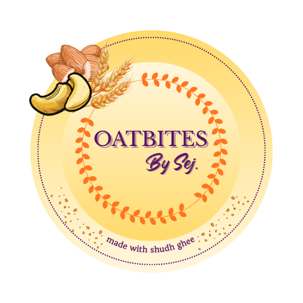

<p align="center">
  
</p>

<h1 align="center">🌾 Oatbites by SEJ</h1>

<p align="center">
  <strong>Premium Oat-Based Snacks — Handcrafted with Love</strong><br/>
  A full-featured e-commerce platform built with modern web technologies.
</p>

<p align="center">
  
  
  
  
  
  
</p>

<p align="center">
  <a href="https://oatbites.in" target="_blank">🌐 Live Website</a> •
  <a href="https://www.instagram.com/oatbites_by_sej">📸 Instagram</a> •
  <a href="#-features">✨ Features</a> •
  <a href="#-tech-stack">🛠️ Tech Stack</a> •
  <a href="#-getting-started">🚀 Setup</a>
</p>

---

## 🎯 About

At **OatBites by Sej**, we believe that healthy snacking should be simple, delicious, and made with ingredients you can trust. Each OatBite is carefully handcrafted using thoughtfully selected ingredients and prepared in small batches to ensure quality and freshness.

> More than just a snack brand, **OatBites by Sej** is a commitment to wholesome living.

---

## ✨ Features

### 🛍️ Shopping Experience
- **Product Catalog** — Browse premium oat-based products with detailed descriptions, images, and pricing
- **Smart Cart** — Add/remove items with quantity controls and real-time price calculation
- **Cart Sync** — Cart data syncs across devices via MongoDB for logged-in users
- **Razorpay Checkout** — Secure payment processing with HMAC signature verification
- **Order Tracking** — Real-time order status updates (Processing → Shipped → Delivered)
- **Product Reviews** — Star ratings and customer reviews with verified purchase badges

### 📱 Progressive Web App (PWA)
- **Installable** — Install as a native app on any device (Android, iOS, Desktop)
- **Offline Support** — Service worker with cache-first strategy for offline browsing
- **Push Notifications** — Real-time order updates and back-in-stock alerts via Web Push API
- **Android APK** — Native Android app via Trusted Web Activity (TWA)

### 🔔 Notification System
- **Email Notifications** — Beautiful HTML emails via Gmail SMTP (Nodemailer)
  - Order confirmation with itemized receipt
  - Shipping status updates
  - Back-in-stock alerts
- **Push Notifications** — Browser push notifications using VAPID keys
- **In-App Toasts** — Real-time feedback for user actions

### 👤 User Dashboard
- **Flipkart-Style Profile** — Complete account management with avatar and settings
- **Multiple Shipping Addresses** — Save and manage multiple delivery addresses
- **Order History** — View all past orders with detailed breakdowns
- **Address Selection** — Amazon-style "Deliver to" dropdown in header

### 👑 Admin Panel
- **Order Management** — View, update status, and manage all customer orders
- **User Insights** — Detailed customer profiles with order history and address data
- **Inventory Control** — Real-time stock tracking and product management
- **Analytics Dashboard** — Track visits, sales, and user engagement with Recharts
- **Role-Based Access** — Server-side admin authorization via email whitelist

### 🎨 Design & UX
- **3D Product Showcase** — Interactive Three.js animations on the homepage
- **Modern UI** — Glassmorphism, smooth gradients, and micro-animations
- **Responsive Design** — Fully optimized from 320px mobile to 4K desktop
- **Multi-Language** — English and Hindi support with persistent locale
- **Dark Theme Footer** — Frosted glass footer with About Us and social links

### 🔒 Security
- **Google OAuth 2.0** — Secure authentication via NextAuth.js v5
- **Credentials Auth** — Email/password login with bcrypt hashing
- **Payment Verification** — Razorpay HMAC signature validation
- **Protected Routes** — Server-side session checks on all sensitive endpoints

---

## 🛠️ Tech Stack

| Layer | Technology |
|---|---|
| **Framework** | Next.js 15 (App Router) |
| **Frontend** | React 19, Vanilla CSS (Custom Design System) |
| **3D Graphics** | Three.js, React Three Fiber, Drei |
| **Authentication** | NextAuth.js v5 (Google OAuth + Credentials) |
| **Database** | MongoDB Atlas (Cloud NoSQL) |
| **Payments** | Razorpay (Test + Production) |
| **Email** | Nodemailer (Gmail SMTP) |
| **Push Notifications** | Web Push API (VAPID) |
| **Charts** | Recharts |
| **PWA** | Service Worker + Web App Manifest |
| **Android** | Trusted Web Activity (TWA) |
| **SEO** | Dynamic Sitemap + Robots.txt |
| **Deployment** | Vercel (Auto CI/CD from GitHub) |

---

## 📁 Project Structure

```
oatbites-by-sej/
├── public/
│   ├── icons/              # PWA app icons (192x192, 512x512)
│   ├── images/             # Product images and assets
│   ├── manifest.json       # PWA manifest
│   ├── sw.js               # Service worker (offline + caching)
│   └── logo.png            # Brand logo
├── src/
│   ├── app/
│   │   ├── admin/          # 👑 Admin dashboard and management
│   │   ├── api/            # 🔌 Backend API routes
│   │   │   ├── auth/       #    Authentication endpoints
│   │   │   ├── cart/       #    Cart sync API
│   │   │   ├── orders/     #    Order create, verify, user orders
│   │   │   ├── push/       #    Push notification subscriptions
│   │   │   ├── reviews/    #    Product review CRUD
│   │   │   └── analytics/  #    Analytics tracking
│   │   ├── checkout/       # 💳 Checkout and payment flow
│   │   ├── dashboard/      # 📋 User account management
│   │   ├── login/          # 🔐 Login page
│   │   ├── register/       # 📝 Registration page
│   │   ├── products/       # 🛒 Product listing and detail pages
│   │   └── order-confirmation/ # ✅ Order success page
│   ├── components/
│   │   ├── Header.js       # 📍 Navigation with address dropdown
│   │   ├── CartDrawer.js   # 🛒 Slide-out cart panel
│   │   ├── Scene.js        # 🎮 3D Three.js homepage animation
│   │   ├── ReviewSection.js # ⭐ Product reviews and ratings
│   │   ├── InstallPrompt.js # 📲 PWA install banner
│   │   ├── PushNotificationManager.js # 🔔 Push notification handler
│   │   └── Toast.js        # 💬 Toast notification component
│   ├── context/
│   │   └── CartContext.js   # 🔄 Cart state with MongoDB sync
│   ├── lib/
│   │   ├── db.js           # 🗄️ MongoDB connection and queries
│   │   ├── email.js        # 📧 Email templates and sending
│   │   └── push.js         # 🔔 Push notification utilities
│   ├── data/               # 📦 Product data and constants
│   └── auth.js             # 🔑 NextAuth.js configuration
└── package.json
```

---

## 🚀 Getting Started

### Prerequisites
- **Node.js** 18+
- [MongoDB Atlas](https://www.mongodb.com/cloud/atlas) cluster
- [Google Cloud](https://console.cloud.google.com) OAuth credentials
- [Razorpay](https://razorpay.com) API keys
- Gmail account with [App Password](https://myaccount.google.com/apppasswords) (for emails)

### Installation

```bash
# Clone the repository
git clone https://github.com/sumeetgwork-stack/oatbites.git
cd oatbites

# Install dependencies
npm install

# Start development server
npm run dev
```

### Environment Variables

Create a `.env.local` file in the root directory:

```env
# Google OAuth 2.0
AUTH_GOOGLE_ID=your_google_client_id
AUTH_GOOGLE_SECRET=your_google_client_secret
AUTH_SECRET=your_nextauth_secret

# Razorpay
RAZORPAY_KEY_ID=your_razorpay_key_id
RAZORPAY_KEY_SECRET=your_razorpay_key_secret
NEXT_PUBLIC_RAZORPAY_KEY_ID=your_razorpay_key_id

# MongoDB Atlas
MONGODB_URI=mongodb+srv://your_connection_string

# Admin
ADMIN_EMAIL=your_admin@email.com

# Gmail SMTP (Order Emails)
GMAIL_USER=your_gmail@gmail.com
GMAIL_APP_PASSWORD=your_gmail_app_password

# Web Push (VAPID Keys)
NEXT_PUBLIC_VAPID_PUBLIC_KEY=your_vapid_public_key
VAPID_PRIVATE_KEY=your_vapid_private_key
```

> 💡 **Tip:** Generate VAPID keys using `npx web-push generate-vapid-keys`

---

## 🌐 Deployment

### Vercel (Recommended)

This project is optimized for **Vercel** with automatic deployments from GitHub.

1. Push to GitHub
2. Connect repository to [Vercel](https://vercel.com)
3. Add all environment variables in Vercel dashboard
4. Deploy! 🚀

> ⚠️ **Important:** Add your Vercel deployment URL to Google OAuth Authorized Redirect URIs in your Cloud Console.

### Android App (TWA)

The Android app is built as a **Trusted Web Activity** wrapper:

1. Open the `oatbites-android/` folder in Android Studio
2. Build → Generate Signed Bundle/APK
3. The APK wraps the live Vercel website as a native Android app

---

## 📸 Screenshots

| Homepage | Product Page | Cart |
|---|---|---|
| 3D animated hero | Detailed product view | Slide-out cart drawer |

| Dashboard | Admin Panel | Checkout |
|---|---|---|
| Order history & profile | Order management | Razorpay integration |

---

## 🤝 Connect

<p align="center">
  <a href="https://oatbites.in">🌐 Website</a> •
  <a href="https://www.instagram.com/oatbites_by_sej">📸 Instagram</a>
</p>

---

## 📄 License

This project is proprietary software developed for **Oatbites by SEJ**.

---

<p align="center">
  <strong>Crafted with ❤️ by Sumeet Gupta</strong><br/>
  <sub>Next.js • React • MongoDB • Razorpay • PWA • Three.js</sub>
</p>
